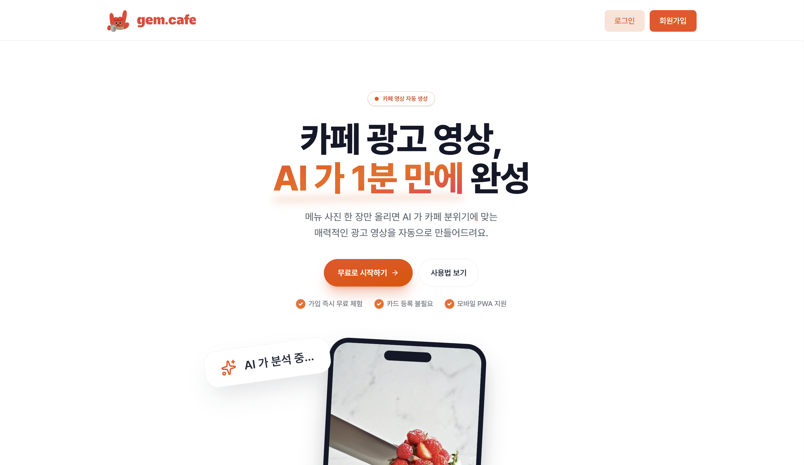
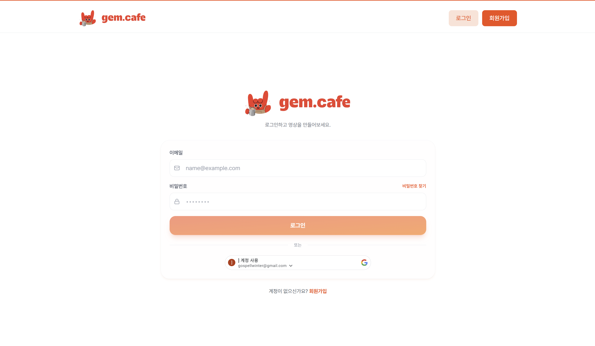
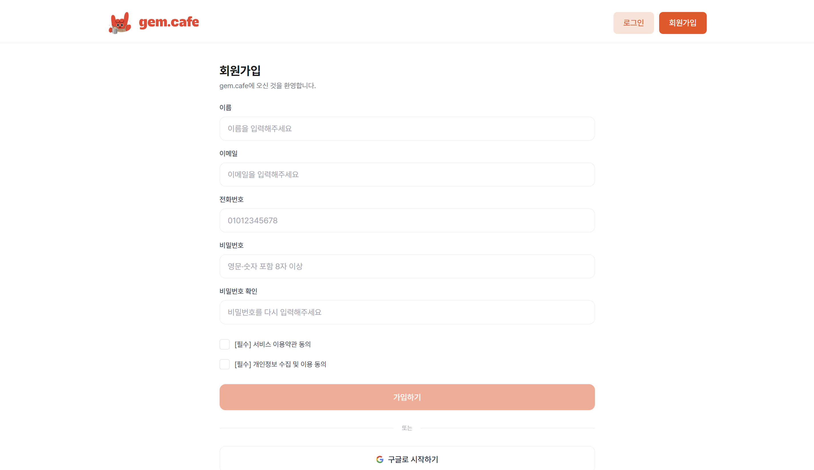
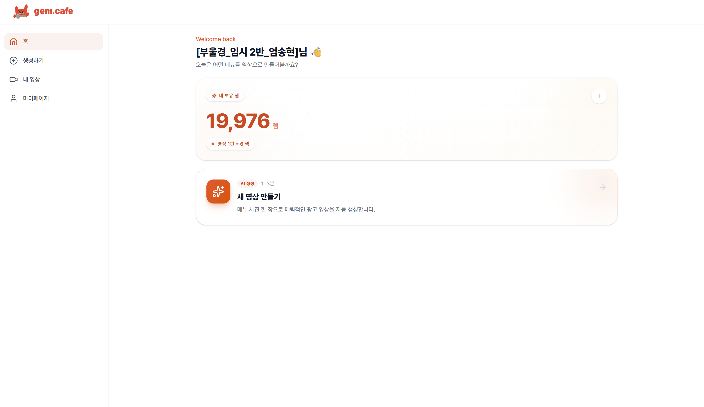
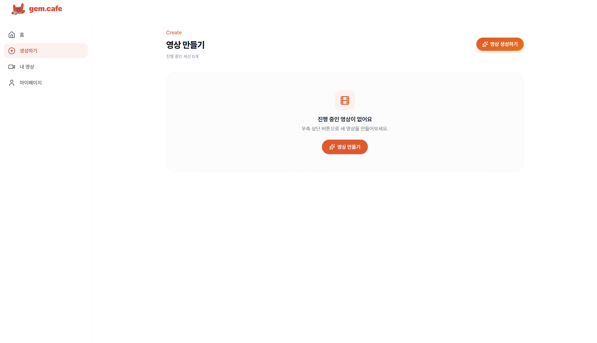
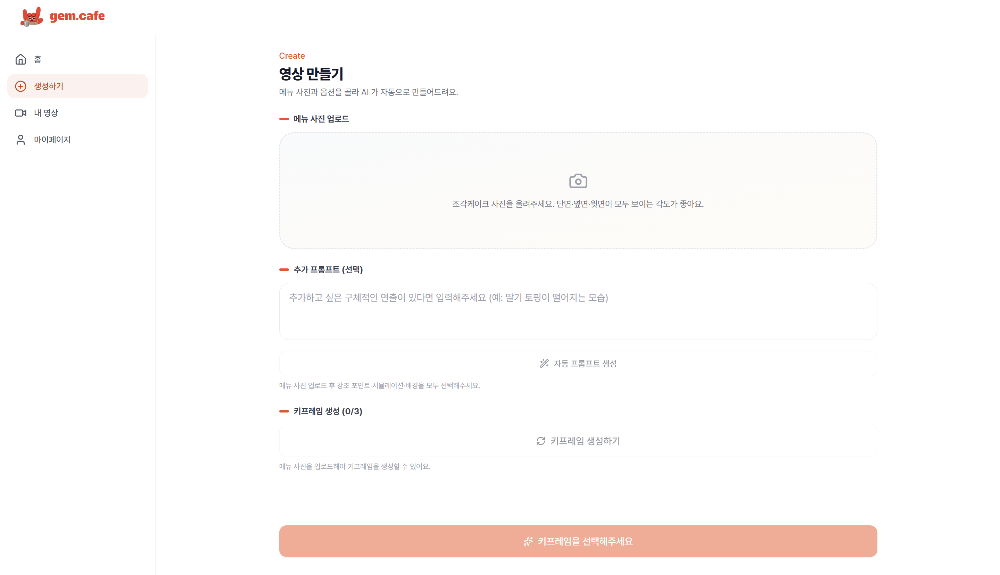
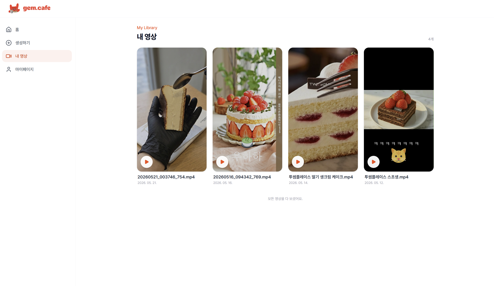
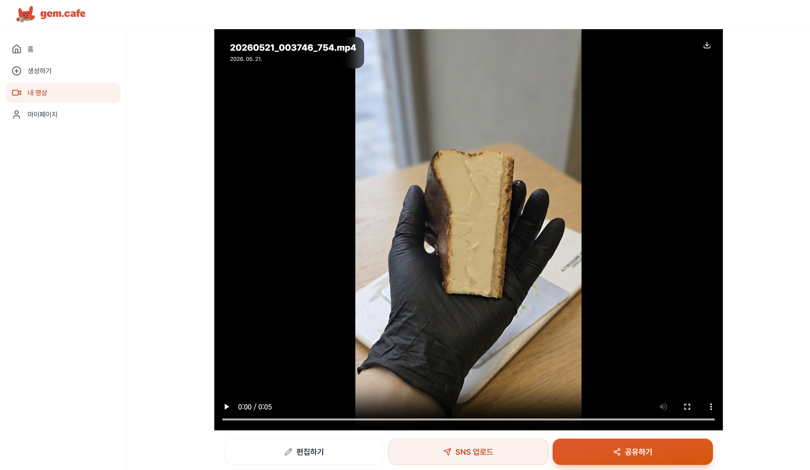
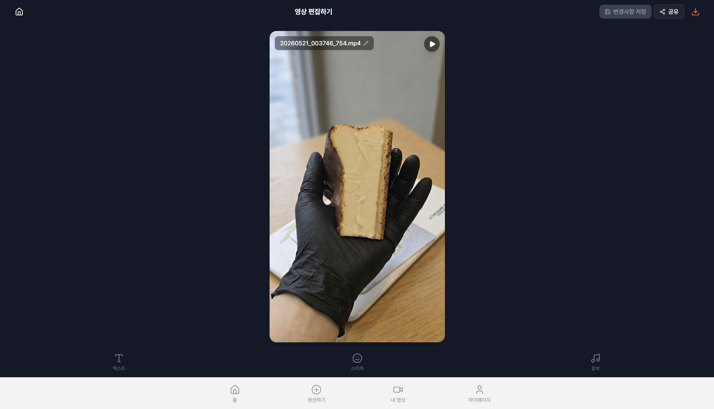
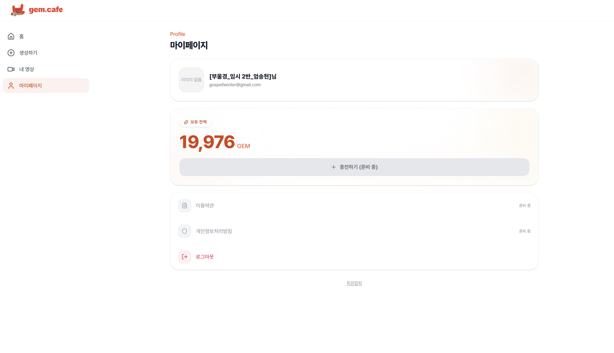

# gem.cafe 기능 명세

> 카페 사장님이 케이크 사진 한 장으로 SNS 광고 영상을 자동 생성하는 모바일 PWA

---

## 목차

1. [인증](#1-인증)
2. [홈](#2-홈)
3. [AI 영상 생성](#3-ai-영상-생성)
4. [내 영상](#4-내-영상)
5. [영상 편집기](#5-영상-편집기)
6. [마이페이지](#6-마이페이지)
7. [PWA](#7-pwa)

---

## 1. 인증

### 1.1 소개 페이지 (IntroPage)
- 비로그인 사용자 진입점 — 로그인/회원가입 버튼 제공
- 서비스 핵심 기능 소개 (무료 체험, 카드 불필요, 모바일 PWA)


### 1.2 로그인 (LoginPage)
- 이메일/비밀번호 로그인
- **Google OAuth 2.0** — Google Identity Services SDK로 ID 토큰 발급 → BE 검증
- 회원가입 직후 진입 시 이메일 자동 채움
- 로그인 성공 후 `/users/me`로 프로필·잼 잔액 동기화

| API | 설명 |
|---|---|
| `POST /auth/login` | 이메일/비밀번호 로그인 |
| `POST /auth/google` | 구글 ID 토큰 검증 |
| `GET /users/me` | 프로필 동기화 |


### 1.3 회원가입 (SignupPage)
- 이름, 이메일, 전화번호, 비밀번호(확인) 입력
- 클라이언트 유효성 검사 (이메일 형식, 비밀번호 강도, 전화번호 형식)
- 이용약관·개인정보처리방침 동의 체크박스

| API | 설명 |
|---|---|
| `POST /auth/signup` | 회원가입 |


### 1.4 전화번호 추가 입력 (CompleteSignupPage)
- Google OAuth 신규 사용자 전용 2단계 — 전화번호 추가 입력
- 이미 전화번호가 있으면 홈으로 리다이렉트

| API | 설명 |
|---|---|
| `PATCH /users/me/phone` | 전화번호 등록 |

---

## 2. 홈

### 2.1 홈 화면 (HomePage)
- 사용자 닉네임 환영 배너
- **잼(gem) 잔액** 크게 표시 — 영상 1편 생성 시 6잼 소모
- 새 영상 만들기 CTA 버튼

---

## 3. AI 영상 생성

### 3.1 진행 중 세션 목록 (CreateLandingPage)
- 완성되지 않은 영상 작업 목록을 카드 그리드로 표시
- **이어서 만들기** — 카드 클릭 시 이전 선택값(키워드·시뮬레이션·배경·프롬프트·키프레임)이 자동 복원
- 영상 생성 중(`SUBMITTED`) 상태 카드는 진행 화면으로 이동

| API | 설명 |
|---|---|
| `GET /cakes/sessions/in-progress` | 진행 중 세션 목록 |
| `GET /cakes/sessions/{id}` | 세션 상세 (복원용) |


### 3.2 AI 영상 생성 (CreateVideoPage)

케이크 사진 1장으로 영상을 만드는 8단계 플로우


**Step 1. 사진 업로드 & 분석**
- 이미지 선택 → BE에 전송 → Moondream3가 케이크 구성 분석
- 분석 결과: 베이스(base) · 크림(creams) · 토핑(toppings) · 코팅(coating) 키워드 반환

**Step 2. 강조 키워드 선택**
- 분석 결과 키워드를 칩(chip) 형태로 표시
- 1개 선택 → 선택한 카테고리에 맞는 시뮬레이션만 필터링

**Step 3. 시뮬레이션 선택**
- 강조 키워드 카테고리별 가능한 시뮬레이션 표시
  - base: 포크로 뜨기, 칼로 단면 가르기, 한 조각 들어올리기
  - creams: 뭉개기, 한 스푼 떠내기, 손으로 반 가르기
  - toppings: 위에서 떨어트리기

**Step 4. 배경 선택**
- 흰 대리석, 카페 인테리어, 야외 정원, 원목 테이블, 미니멀 화이트, 어두운 무드

**Step 5~6. 프롬프트**
- 추가 힌트 직접 입력 (선택)
- **자동 프롬프트 생성** — Gemini가 선택값 기반 한국어 영상 묘사 자동 생성 (편집 가능)

**Step 7. 키프레임 생성**
- 최대 3회 시도 가능 — 생성된 키프레임 이미지 중 1개 선택
- `frame_strategy`에 따라 키프레임이 시작·마지막 프레임으로 배치

**Step 8. 영상 생성**
- 선택한 키프레임 기반 Veo 3.1로 5~6초 MP4 영상 생성 (1~3분 소요)
- 6잼 차감

| API | 설명 |
|---|---|
| `POST /cakes/analyze` | 이미지 분석 |
| `PATCH /cakes/sessions/{id}/selections` | 선택값 저장 |
| `POST /cakes/sessions/{id}/preview-prompts` | 자동 프롬프트 생성 |
| `PATCH /cakes/sessions/{id}/video-prompt` | 프롬프트 저장 |
| `POST /cakes/sessions/{id}/keyframes` | 키프레임 생성 |
| `POST /cakes/sessions/{id}/select-keyframe` | 키프레임 선택 |
| `POST /videos` | 영상 생성 시작 |

### 3.3 영상 생성 대기 (CreatingPage)
- 3초 폴링으로 생성 상태 확인
- 완료 → 영상 상세 페이지로 자동 이동
- 실패 → 에러 메시지 + 재시도 안내

| API | 설명 |
|---|---|
| `GET /videos/{id}/status` | 생성 상태 폴링 |

---

## 4. 내 영상

### 4.1 내 영상 목록 (MyVideosPage)
- 커서 기반 무한 스크롤 (12개씩)
- 썸네일 카드 그리드 — 클릭 시 상세 페이지 이동


| API | 설명 |
|---|---|
| `GET /videos?cursor=N&size=12` | 영상 목록 (커서 페이지네이션) |

### 4.2 영상 상세 (VideoDetailPage)
- 풀스크린 영상 재생 (`AuthedVideo` — 인증 헤더 포함 blob 스트리밍)
- 영상 제목, 파일명, 생성일 표시


**다운로드**
- 워터마크 삽입 후 로컬 저장
- 한 번 생성한 워터마크 파일은 페이지 내 캐시 — 재클릭 시 BE 재호출 없이 즉시 다운로드

**공유**
- `navigator.share` Web Share API 활용 (Chrome user-gesture 정책 대응 — 2단계 모달)
- 워터마크 파일 공유 지원, 브라우저 미지원 시 링크만 공유

**SNS 업로드**
- YouTube · Instagram 플랫폼 선택
- 제목, 설명, 태그, 캡션 입력
- SSE로 업로드 진행 상태 구독 → 완료 시 PWA 푸시 알림

**편집하기**
- VideoEditor 페이지로 이동 (영상 정보 state로 전달)

| API | 설명 |
|---|---|
| `GET /videos/{id}` | 영상 상세 조회 |
| `POST /videos/{id}/watermark-download` | 워터마크 다운로드 URL 발급 |
| `POST /videos/{id}/social-upload` | SNS 업로드 요청 |
| `PATCH /videos/{id}` | 영상 정보 수정 |

---

## 5. 영상 편집기

### 5.1 VideoEditor
- AI 생성 영상에 텍스트·스티커·BGM을 합성하는 풀스크린 캔버스 에디터



**텍스트 오버레이**
- 한글 폰트 6종 (나눔고딕, 나눔명조, 고운돋움, 제주명조, 블랙한산스, 가구체)
- 5단계 크기 프리셋 (32~110px / 디자인 기준 960px 높이 정규화)
- 15색 팔레트, Bold · Italic · Outline · 회전 지원
- 드래그로 위치 이동

**스티커 오버레이**
- Twemoji 기반 93개 이모지 (8 카테고리: 음료, 디저트, 과일, 하트반짝, 자연, 꾸미기, 표정, 동물)
- 드래그 이동 · 핀치 리사이즈 · 회전

**BGM**
- Audius API로 카테고리별 음원 검색 및 미리듣기
- 볼륨 조절, Web Audio API로 원본음 + BGM 믹싱

**합성 파이프라인**
```
<video> 매 프레임
  → Canvas (drawImage)
  → 텍스트 · 스티커 레이어 합성
  → canvas.captureStream() + AudioContext 믹싱
  → MediaRecorder → MP4 blob
```

**저장 & 다운로드**
- 변경사항 저장 → `PATCH /videos/{id}` (videoFile + thumbnail multipart)
- 다운로드 → 워터마크 삽입 후 저장 (`POST /videos/{id}/watermark-download`)

| API | 설명 |
|---|---|
| `PATCH /videos/{id}` | 편집본 저장 (multipart) |
| `POST /videos/{id}/watermark-download` | 워터마크 다운로드 |

---

## 6. 마이페이지

### 6.1 MyPage
- 프로필 카드 (닉네임, 이메일, 프로필 사진)
  - 프로필 사진: `AuthedImage` 컴포넌트로 인증 헤더 포함 로드 (401 방지)
- 잼 잔액 표시
- 로그아웃 (`POST /auth/logout` → localStorage 초기화 → `/login` 이동)
- 마운트 시 `/users/me`로 최신 프로필·잔액 동기화

| API | 설명 |
|---|---|
| `GET /users/me` | 프로필 동기화 |
| `POST /auth/logout` | 로그아웃 |

---

## 7. PWA

### 7.1 설치 프롬프트 (InstallAppBanner)
- Android Chrome: `beforeinstallprompt` 이벤트 캡처 → 인앱 설치 배너
- iOS Safari: "공유 → 홈 화면에 추가" 수동 안내
- `sessionStorage`로 닫음 상태 기억, `standalone` 모드에선 숨김



### 7.2 업데이트 알림 (PWAUpdatePrompt)
- 새 Service Worker 감지 시 토스트 노출
- "새로고침" 클릭 → `updateServiceWorker(true)`로 즉시 적용

### 7.3 작업 완료 푸시 알림
- 영상 생성·워터마크 처리 완료 시 Web Push 발송
- 알림 클릭 → 해당 영상 상세 페이지로 이동 (백그라운드·탭 닫힘 모두 동작)
- Service Worker 3단 폴백: 같은 URL 탭 focus → 같은 origin 탭 navigate → 새 창 open
