# gem.mark 기능 명세

> 영상 워터마크 삽입·검출·강건성 평가를 수행하는 B2B 어드민 보안 플랫폼

---

## 목차

1. [인증](#1-인증)
2. [대시보드](#2-대시보드)
3. [워터마크 삽입](#3-워터마크-삽입)
4. [워터마크 검출](#4-워터마크-검출)
5. [강건성 테스트](#5-강건성-테스트)
6. [리포트](#6-리포트)

---

## 1. 인증

### 1.1 로그인 (LoginPage)
- 어드민 ID/비밀번호 로그인
- 유효성 검사 에러는 입력 후(blur) 또는 제출 시에만 표시 — UX 개선
- 로그인 성공 후 원래 요청 페이지로 리다이렉트 (guard 처리)
- 에러 분기: 401/403 → 인증 실패, 422 → 입력 형식 오류, 네트워크 → 연결 오류

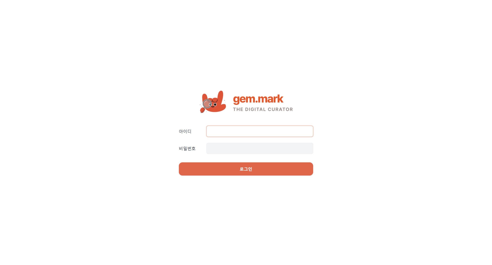

| API | 설명 |
|---|---|
| `POST /auth/login` | 어드민 로그인 (accessToken + refreshToken) |

---

## 2. 대시보드

### 2.1 대시보드 (DashboardPage)
운영 현황을 한눈에 확인하는 메인 화면

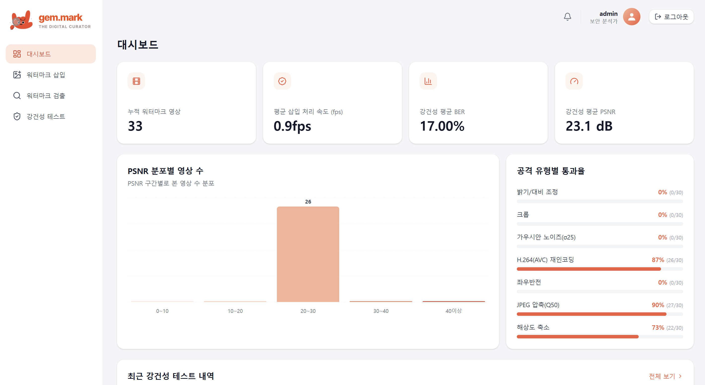

**KPI 카드 4종**

| 지표 | 설명 |
|---|---|
| 누적 워터마크 영상 수 | 전체 삽입 완료 건수 (오늘 +N 배지) |
| 평균 처리 시간 | 워터마크 삽입 평균 소요 시간 (초) |
| 평균 BER | 강건성 테스트 평균 비트 오류율 (≤ 0.1 이하 목표) |
| 평균 PSNR | 워터마크 삽입 후 화질 지표 (높을수록 원본에 가까움) |

**차트**
- **검증 트렌드 차트**: 기간별 워터마크 검출 이력 (라인/에어리어)
- **공격 유형 통계**: 강건성 테스트에서 시도된 공격 유형별 비율
- **최근 활동**: 최신 삽입·검출·강건성 테스트 작업 목록

---

## 3. 워터마크 삽입

### 3.1 삽입 목록 (WatermarkInsertPage)
- 워터마크 삽입 완료된 영상 목록 (20개씩 페이지네이션)
- 컬럼: 파일명, 생성일, 크기, 형식, 처리 시간
- 행 클릭 → 상세 페이지
- "워터마크 삽입" 버튼 → 새 삽입 페이지

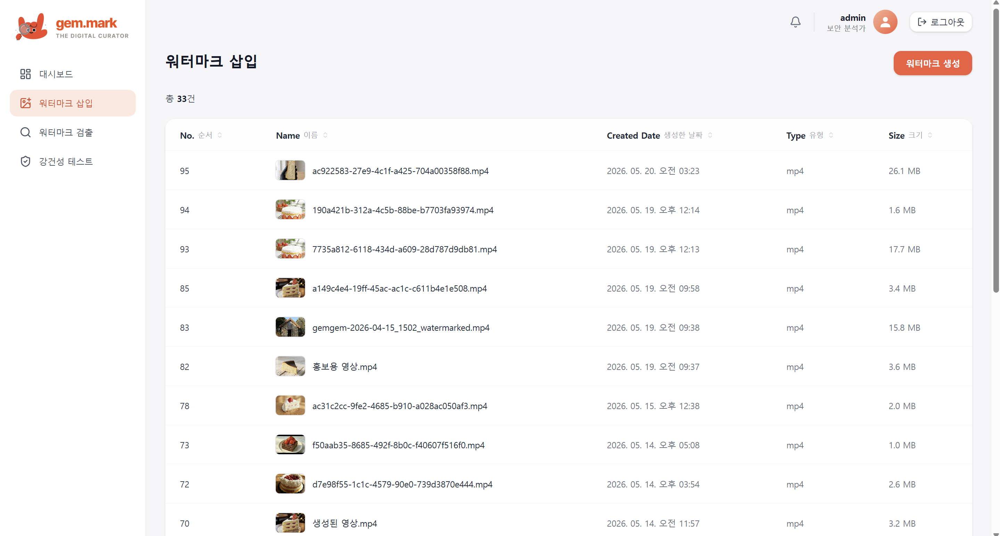

| API | 설명 |
|---|---|
| `GET /videos?page=N&size=20` | 삽입 영상 목록 |

### 3.2 워터마크 삽입 (WatermarkInsertCreatePage)

**워크플로우**
```
1. 영상 파일 업로드 (드래그앤드롭 또는 파일 선택)
      ↓
2. Alpha 파라미터 설정 (워터마크 강도 1~100; 기본값: config 설정값)
      ↓
3. 삽입 시작 → 처리 중 스피너
      ↓
4. 완료 → 워터마크 삽입 영상 다운로드 가능
      ↓
5. 다시 업로드 버튼으로 새 작업 시작
```

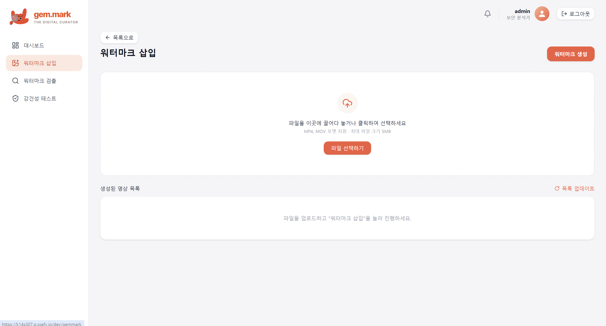

**기술 구현**
- DCT 기반 스프레드 스펙트럼 워터마크
- Y채널 8×8 블록의 [2,1] 계수에 PN 시퀀스를 spread-spectrum 방식으로 삽입
- `video_uuid:downloader_user_id` SHA-256 해시 → 32비트 결정론적 페이로드 생성
- H.264 CRF 0 + yuv444p 무손실 인코딩으로 신호 보존

| API | 설명 |
|---|---|
| `POST /videos/upload` | 영상 업로드 |
| `POST /watermark/embed` | 워터마크 삽입 실행 |
| `GET /watermark/{id}/download` | 삽입 완료 영상 다운로드 |

### 3.3 삽입 상세 (WatermarkInsertDetailPage)
- 삽입 작업 상세 정보 조회
- 사용된 파라미터 (alpha값, 페이로드 비트 수, Business ID)
- 처리 성능 (처리 시간, 처리 fps, PSNR)
- 워터마크 HEX 값, Content UUID

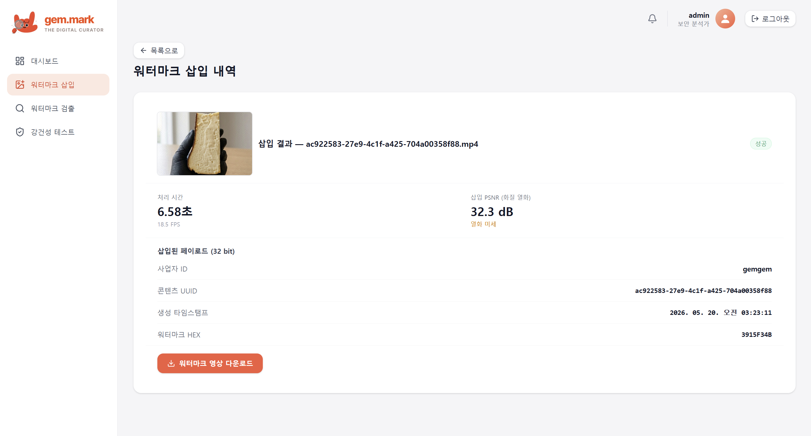

| API | 설명 |
|---|---|
| `GET /videos/{uuid}` | 삽입 상세 조회 |

---

## 4. 워터마크 검출

### 4.1 검출 이력 목록 (WatermarkDetectPage)
- 워터마크 검증 시도 이력 (20개씩 페이지네이션)
- 컬럼: 파일명, 검증일, 상태(DETECTED/NOT_DETECTED), 정확도
- "워터마크 검출" 버튼 → 새 검증 페이지

| API | 설명 |
|---|---|
| `GET /verifications?page=N&size=20` | 검증 이력 목록 |

### 4.2 워터마크 검출 (WatermarkDetectCreatePage)

**워크플로우**
```
1. 검증할 영상 파일 업로드
      ↓
2. 워터마크 검증 버튼 클릭
      ↓
3. DCT 추출 → DB 저장값과 BER 비교
      ↓
4. 결과 표시
   - VERIFIED: Content UUID, Business ID, 삽입일, BER 값
   - NOT VERIFIED: 불일치 안내
```

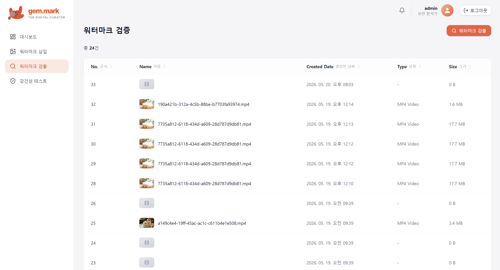

**검증 알고리즘**
- 균등 간격으로 8 프레임 샘플링 → 각 프레임에서 DCT 추출 → 다수결(majority vote)
- BER(Bit Error Rate) < 0.1 이면 원본 판정
- DB 전체 활성 워터마크 레코드 중 BER 최솟값 매칭

**결과 컴포넌트**
- `VerificationResultCard`: VERIFIED / NOT VERIFIED 뱃지, 정확도
- `ExtractedWatermarkCard`: UUID, Business ID, 삽입일, BER

| API | 설명 |
|---|---|
| `POST /videos/upload` | 검증할 영상 업로드 |
| `POST /watermark/verify` | 워터마크 검증 실행 |

### 4.3 검출 상세 (WatermarkDetectDetailPage)
- 과거 검증 이력 상세 조회
- 원본 영상 정보, 추출된 워터마크, BER, 정확도

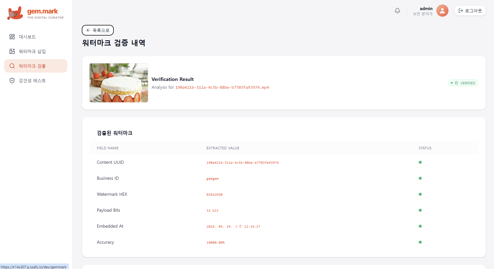

| API | 설명 |
|---|---|
| `GET /verifications/{id}` | 검증 이력 상세 |

---

## 5. 강건성 테스트

워터마크가 다양한 공격(압축, 노이즈, 크롭 등)에 얼마나 견디는지 검증

### 5.1 테스트 이력 (RobustnessTestPage)
- 강건성 테스트 실행 이력 목록
- 컬럼: 기간, 실행일, 관리자, 상태, 총 영상 수, 성공/실패 건수
- 행 클릭 → 테스트 상세
- "테스트 시작" 버튼 → 새 테스트 생성 페이지

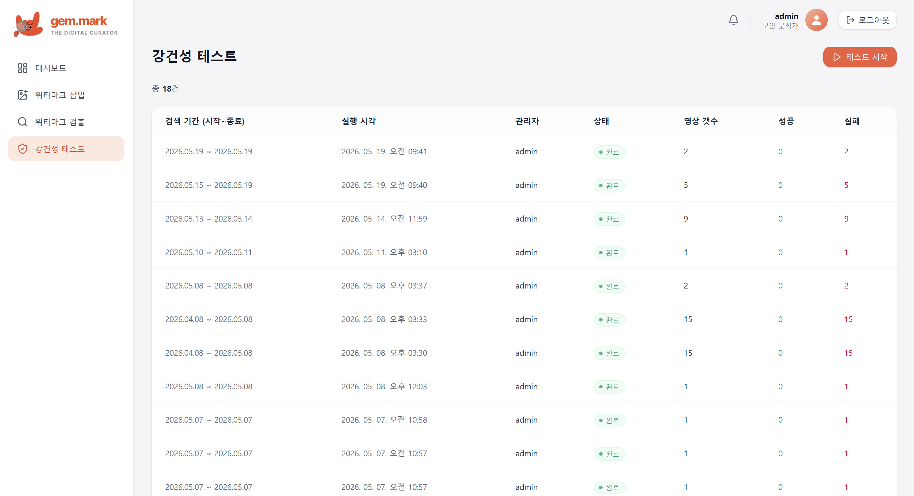

| API | 설명 |
|---|---|
| `GET /robustness/history` | 테스트 이력 목록 |

### 5.2 테스트 생성 (RobustnessTestCreatePage)
- **날짜 범위 선택** (기본: 최근 30일)
- 날짜 변경 300ms 디바운스 후 대상 영상 목록 자동 갱신 (20개씩)
- 시작 버튼 → BE에서 비동기 처리 (fire-and-forget)
- 실행 즉시 이력 페이지로 이동 (완료 대기 없음)

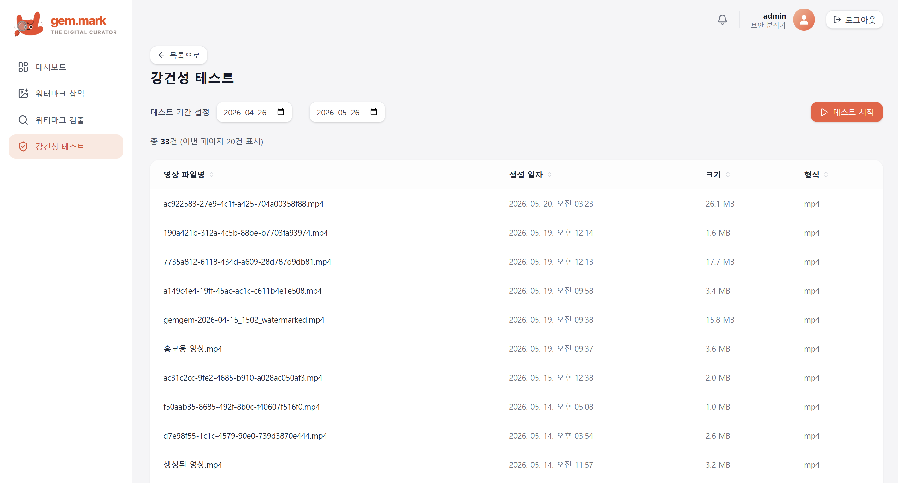

| API | 설명 |
|---|---|
| `GET /robustness?page=1&startDate=X&endDate=Y` | 대상 영상 목록 |
| `POST /robustness/run` | 강건성 테스트 실행 |

### 5.3 테스트 상세 (RobustnessTestDetailPage)
- 완료된 테스트 결과 종합
- **레이더 차트**: 공격 유형별 BER/PSNR 방사형 시각화
- **요약 리포트**: 전체 통계, 공격 유형별 성공/실패 브레이크다운

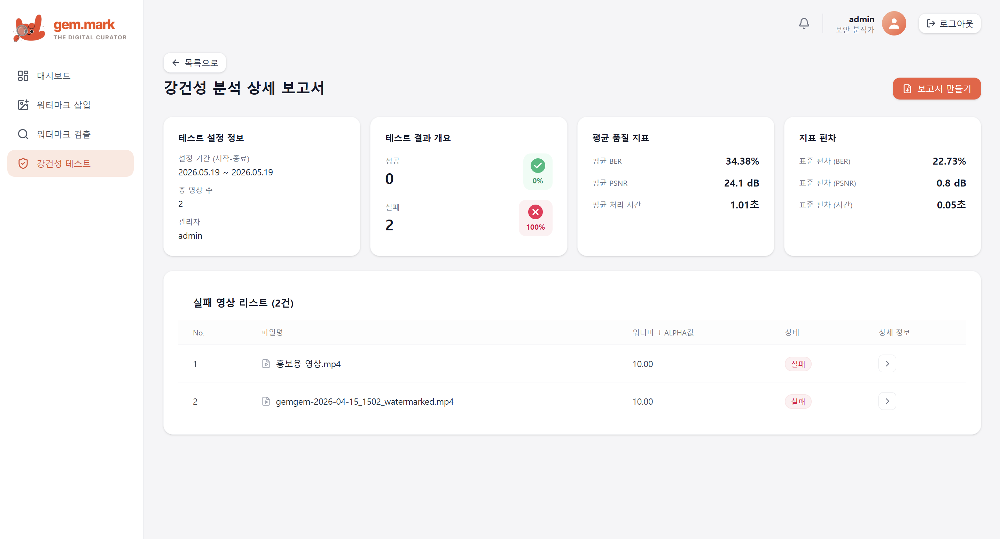

### 5.4 실패 영상 상세 (RobustnessFailedVideoPage)
- 특정 테스트에서 실패한 단일 영상 상세
- 어떤 공격 유형에서 실패했는지, 각 공격별 BER/PSNR

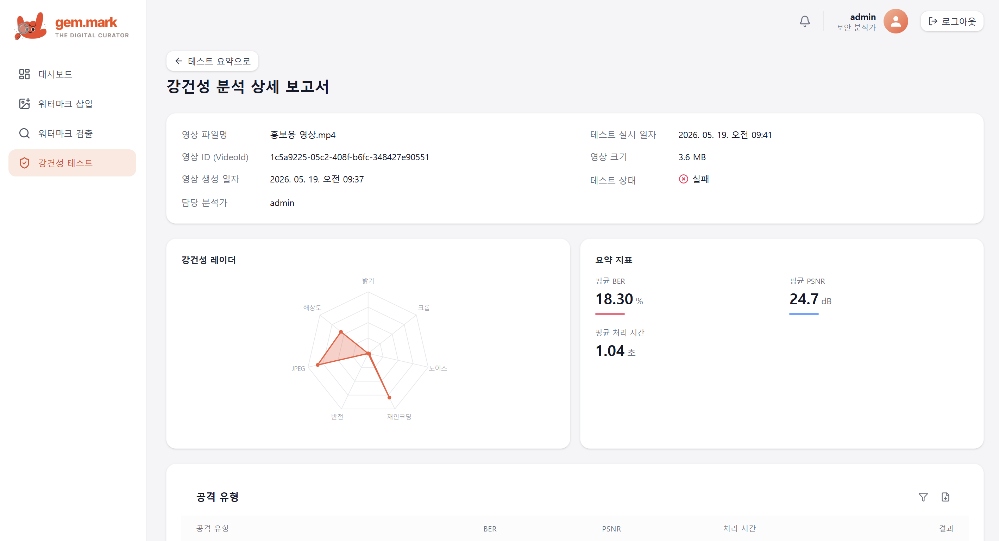

---

## 6. 리포트

### 6.1 리포트 생성 (ReportsPage)
- 워터마크 보안 분석 리포트 생성 UI

**파라미터 설정 (좌측 패널)**
- 리포트 유형: 강건성 상세 보고서
- 날짜 범위 선택
- 포함 섹션 선택: 추출 메타데이터, 강건성 레이더 차트, 공격 결과 테이블, 모델 신뢰도
- 출력 형식: PDF / XLSX

**미리보기 (우측 패널)**
- 설정값 기반 리포트 실시간 레이아웃 미리보기
- 헤더: "GemGem", 생성 시각, "워터마크 보안 분석" 타이틀

---

## 기술 공통 사항

### 인증 보호 라우팅
- `RequireAuth` 컴포넌트로 모든 페이지 보호
- 미인증 접근 → `/login` 리다이렉트 (원래 경로 state로 보존)
- JWT accessToken 만료 → axios 인터셉터가 자동 refresh → 원래 요청 재발사

### 파일 업로드
- `FileDropZone` 컴포넌트: 드래그앤드롭 + 클릭 업로드 통합
- 허용 형식: MP4, MOV, AVI, MKV
- 최대 파일 크기: 100MB

### 워터마크 알고리즘 요약

| 항목 | 값 |
|---|---|
| 방식 | DCT 스프레드 스펙트럼 |
| 삽입 위치 | Y채널 8×8 블록 계수 [2,1] |
| 페이로드 | 32비트 |
| 기본 Alpha | 설정값 (강도 조절 가능) |
| BER 임계값 | 0.1 (10% 이하 → 원본 판정) |
| 인코딩 | H.264 CRF 0 + yuv444p (무손실) |
