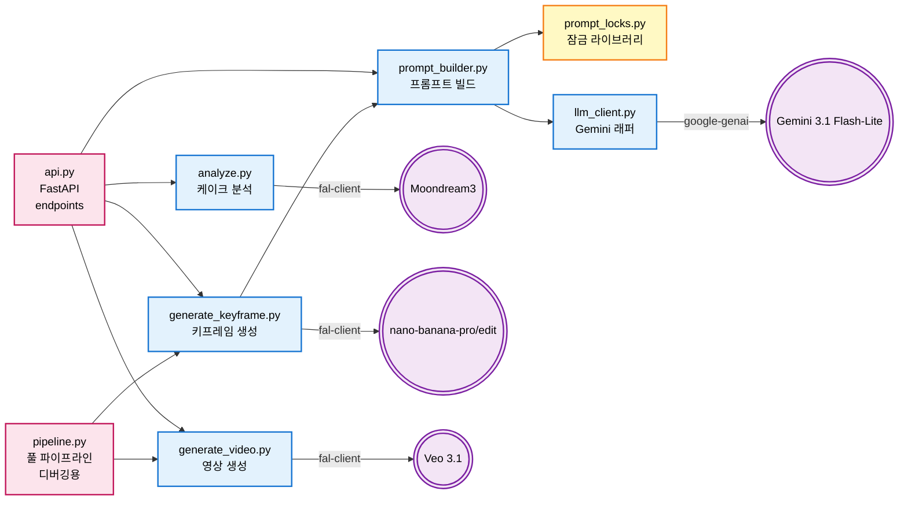
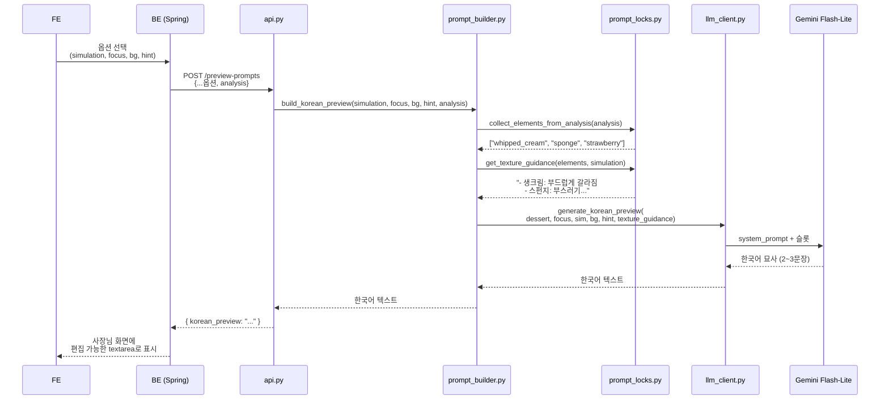
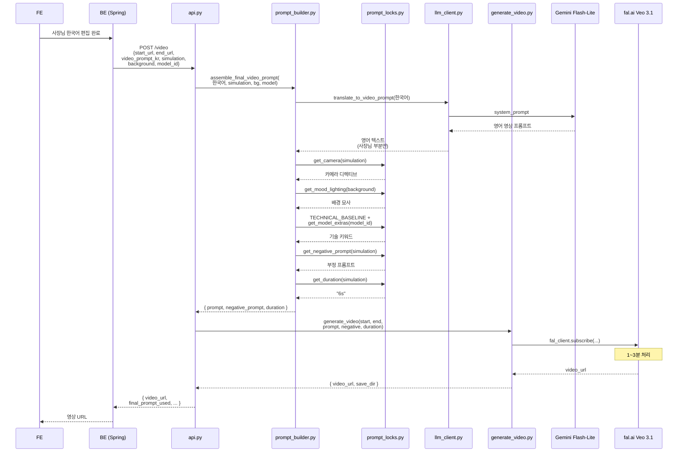
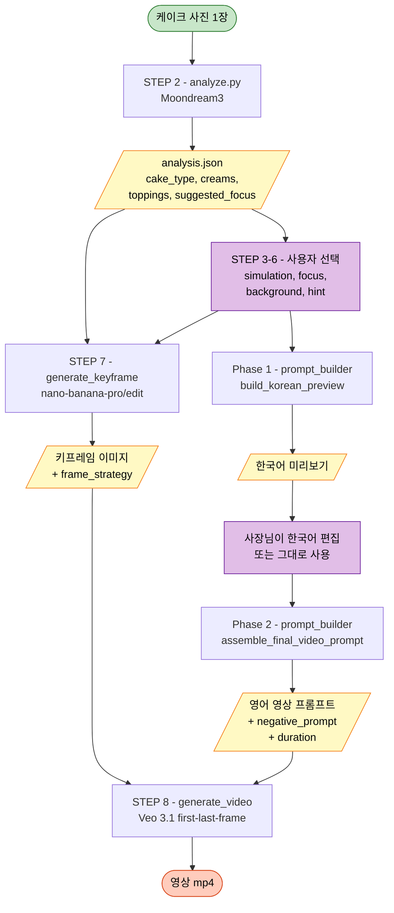

# Gemcafe AI Service — 내부 아키텍처

> 이 문서는 **AI 코드를 직접 수정할 때 어디를 봐야 하는지** 한눈에 파악하기 위한 내부 개발자용 문서입니다. 
> 외부 통합(BE/FE)에 대한 설명은 [README.md](./README.md) 참조. 
> Mermaid Diagram 이므로 → Extensions → "Markdown Preview Mermaid Support" 설치할 것

---

## 1. 파일 호출 관계 (Call Graph)

**범례:**
- 🟥 분홍 = 진입점 (사용자/BE가 호출하는 곳)
- 🟦 파랑 = 핵심 로직 모듈
- 🟨 노랑 = 데이터/잠금 라이브러리 (값만 들어있음)
- 🟪 보라 = 외부 AI 서비스

---

## 2. `/preview-prompts` 엔드포인트 호출 순서

사장님이 옵션 선택 후 한국어 미리보기 받는 흐름.

---

## 3. `/video` 엔드포인트 호출 순서 (한국어 모드)

사장님이 한국어 편집 후 영상 생성 트리거.

---

## 4. 데이터 변환 — 입력에서 출력까지

---

## 5. 파일별 책임 한 줄 요약

| 파일 | 무엇을 함 | 누가 호출 | 무엇을 호출 |
|---|---|---|---|
| **api.py** | FastAPI 엔드포인트 4종 | BE | analyze, generate_keyframe, generate_video, prompt_builder |
| **analyze.py** | Moondream3로 케이크 분석 | api / 단독 | fal.ai (Moondream) |
| **generate_keyframe.py** | 키프레임 1장 생성 | api / pipeline / 단독 | prompt_builder, fal.ai (nano-banana-pro/edit) |
| **generate_video.py** | Veo로 영상 생성 | api / pipeline / 단독 | fal.ai (Veo) |
| **prompt_builder.py** | 모든 프롬프트 빌드/조립 | api / generate_keyframe | prompt_locks, llm_client |
| **prompt_locks.py** | 카메라/기술/질감/부정 잠금 데이터 | prompt_builder | (없음, 데이터만) |
| **llm_client.py** | Gemini 호출 (한↔영, 미리보기) | prompt_builder / 단독 | Google Gemini API |
| **pipeline.py** | 전체를 한 번에 (디버깅용) | 단독 (CLI) | generate_keyframe, generate_video |

---

## 다음에 추가될 다이어그램 (예고)

이 파일은 일단 호출 관계만 담았어요. 다음 단계로 추가할 예정:

- 📊 파일별 함수/변수 상세 표
- 🛠 "새 시뮬레이션 추가하려면 어디 수정?" 체크리스트
- 🔄 데이터 형식 변환 표 (snake_case → 한국어 라벨 등)

필요하시면 알려주세요.
