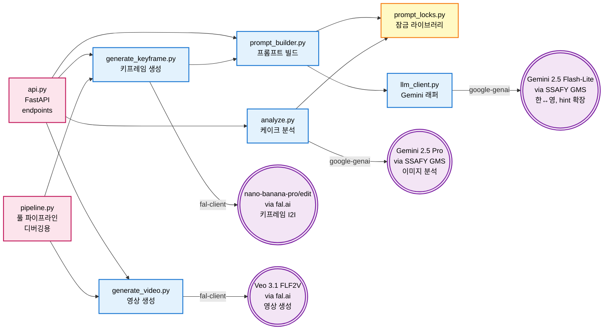
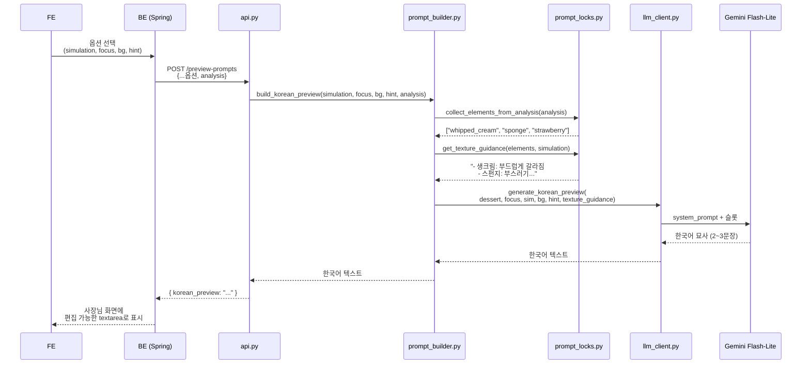
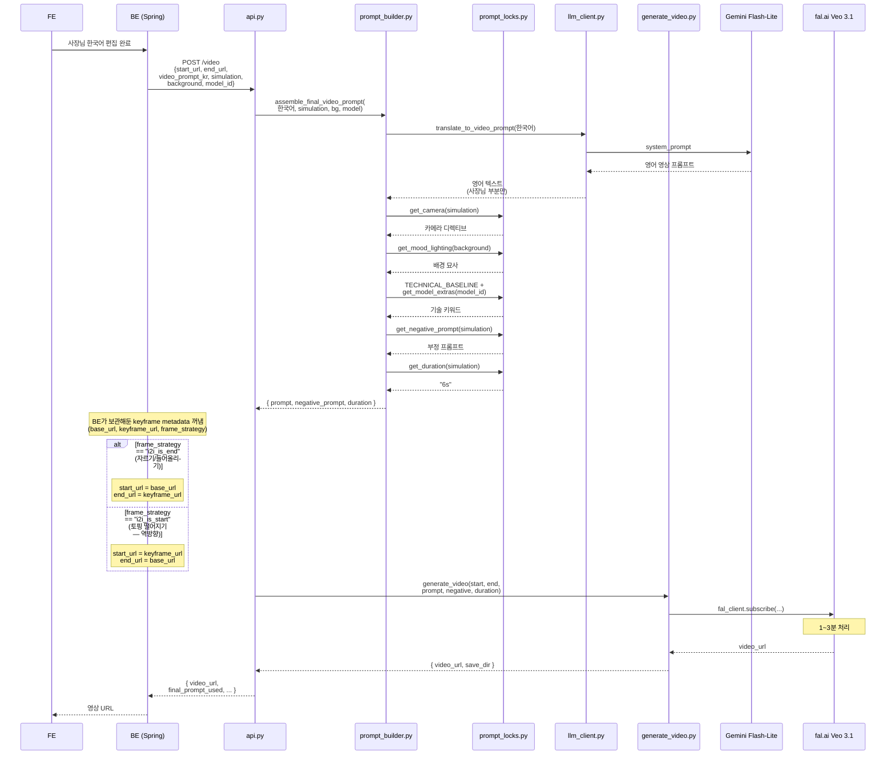

# Gemcafe AI Service — 시스템 구조 다이어그램

> 이 문서는 **AI 시스템 구조를 다이어그램으로 한눈에 파악**하기 위한 내부 개발자용 문서입니다.<br/>
> Mermaid Diagram 이므로 → Extensions → "Markdown Preview Mermaid Support" 설치할 것<br/>
> 코드 수정 시 함수/변수 레퍼런스, 데이터 매핑 표, 시뮬레이션 추가 체크리스트는 [DEVELOPER.md](./DEVELOPER.md) 참조.<br/>
> 외부 통합(BE/FE)에 대한 설명은 [README.md](./README.md) 참조.<br/>


---

## 1. 파일 호출 관계 (Call Graph)



**범례:**
- 🟥 분홍 = 진입점 (사용자/BE가 호출하는 곳)
- 🟦 파랑 = 핵심 로직 모듈
- 🟨 노랑 = 데이터/잠금 라이브러리 (값만 들어있음)
- 🟪 보라 = 외부 AI 서비스

---

## 2. `/preview-prompts` 엔드포인트 호출 순서

사장님이 옵션 선택 후 한국어 미리보기 받는 흐름.



---

## 3. `/video` 엔드포인트 호출 순서 (한국어 모드)

사장님이 한국어 편집 후 영상 생성 트리거.



---

## 4. 사용자 흐름 — 이미지 업로드 → 영상까지 (전체 파이프라인)

사장님 시점의 4단계 흐름. 각 단계마다 **어떤 프롬프트가 만들어지고**, **어떤 잠금 라이브러리가 호출되며**, **어떤 모델로 무엇이 생성되는지** 다이어그램에 그대로 박혀 있습니다.

```mermaid
flowchart TD
    Start([📷 케이크 사진 1장<br/>사장님 업로드]):::input

    %% =====================================================
    %% PHASE 1: 이미지 분석
    %% =====================================================
    subgraph P1["1️⃣ 이미지 분석 — POST /analyze"]
        direction TB
        N["_normalize_image_for_gemini<br/>━━━━━━━━━━━━<br/>EXIF 회전 보정 · RGB 변환<br/>1024→768→512px fallback<br/>JPEG quality=90"]
        AN["analyze_with_gemini<br/>━━━━━━━━━━━━<br/>📦 ANALYSIS_PROMPT<br/>• 6개 few-shot variation pair<br/>• element_textures 5축 규칙<br/>  (consistency, moisture,<br/>   surface, aeration, structure)<br/>• visual cues 매핑<br/>• vocabulary 금지어"]
        AUG["_augment_creamy_bases<br/>━━━━━━━━━━━━<br/>baked_cheese → creamy_interior<br/>를 creams 에 미러링<br/>(FE 카테고리 필터 통과용)"]
        N --> AN --> AUG
    end
    GP(((Gemini 2.5 Pro<br/>via SSAFY GMS))):::ext
    AN <-.->|google-genai| GP

    Start --> N
    AUG --> J1[/analysis.json<br/>━━━━━━━━━<br/>cake_type · base · creams<br/>toppings · coating<br/>key_feature · is_warm · is_layered<br/>element_textures · suggested_focus/]:::data

    %% =====================================================
    %% PHASE 2: 사용자 선택
    %% =====================================================
    J1 --> FE["FE 화면 표시<br/>━━━━━━━━━━━━<br/>suggested_focus 카드<br/>시뮬레이션 카탈로그<br/>배경 6종"]:::user
    FE --> SEL[/사용자 선택<br/>━━━━━━━━━<br/>simulation · focus<br/>background · hint/]:::user

    %% =====================================================
    %% PHASE 3: 한국어 미리보기 (선택)
    %% =====================================================
    subgraph P3["💬 한국어 미리보기 (선택) — POST /preview-prompts"]
        EH["llm_client.expand_hint<br/>━━━━━━━━━━━━<br/>📦 SYSTEM_PROMPT_HINT_EXPAND<br/>'고급스럽게' → 4축 키워드<br/>(조명·모션·분위기·디테일)"]
        KP["build_korean_preview<br/>━━━━━━━━━━━━<br/>📦 SYSTEM_PROMPT_PREVIEW<br/>+ get_texture_guidance<br/>+ collect_elements_from_analysis"]
        EH --> KP
    end
    GFL(((Gemini 2.5<br/>Flash-Lite))):::ext
    KP <-.->|google-genai| GFL

    SEL -.->|hint 있을 때| EH
    SEL -.->|hint 없으면 바로| KP
    J1 -.-> KP
    KP --> KR[/한국어 미리보기<br/>2-3 문장/]:::data
    KR --> EDIT["사장님 편집<br/>(또는 그대로 사용)"]:::user

    %% =====================================================
    %% PHASE 4: 키프레임 생성
    %% =====================================================
    subgraph P4["2️⃣ 키프레임 생성 — POST /keyframe"]
        direction TB
        BP["build_prompts<br/>━━━━━━━━━━━━<br/>🧩 슬롯 채우기:<br/>{focus} {texture} {interior_structure}<br/>{base} {cream} {topping} {coating}<br/>{?slot: phrase} 인라인 마커<br/>━━━━━━━━━━━━<br/>📚 잠금 호출:<br/>• TEXTURE_PROFILES (재료별 질감)<br/>• ELEMENT_ALIASES (변종 정규화)<br/>• SIMULATION_ACTION_TYPE<br/>━━━━━━━━━━━━<br/>📌 analysis 기반 prepend:<br/>• get_cake_structure_context_en<br/>• get_signature_feature_en<br/>• get_temperature_note_en (is_warm)"]
        BP --> P_INST[/instruction_prompt/]:::prompt
        BP --> P_SF[/start_frame_prompt<br/>cream_scoop·lift_slice·hand_split만/]:::prompt
        BP --> P_VID[/video_prompt<br/>PHASE 5에서 사용/]:::prompt

        BG_OPT{background<br/>지정?}:::decision
        BG_CALL["1차 I2I — 배경 교체<br/>━━━━━━━━━━━━<br/>📦 BACKGROUND_INSTRUCTION_TEMPLATE<br/>+ MOOD_LIGHTING[bg_text]<br/>+ SYSTEM_PROMPT (보존 규칙)"]
        SKIP1["배경 교체 skip<br/>원본 그대로"]
        BG_OPT -->|yes| BG_CALL
        BG_OPT -->|no| SKIP1

        SF_OPT{start_frame_template<br/>존재?}:::decision
        SF_CALL["2차 I2I — 시작 프레임<br/>━━━━━━━━━━━━<br/>start_frame_prompt 적용<br/>+ SYSTEM_PROMPT<br/>→ 2_start_frame.jpg"]
        SKIP2["배경 결과를 그대로<br/>2_start_frame.jpg 로"]
        BG_CALL --> SF_OPT
        SKIP1 --> SF_OPT
        SF_OPT -->|yes| SF_CALL
        SF_OPT -->|no| SKIP2

        KF_CALL["3차 I2I — 시뮬 키프레임<br/>━━━━━━━━━━━━<br/>instruction_prompt 적용<br/>+ SYSTEM_PROMPT<br/>→ 3_keyframe.jpg"]
        SF_CALL --> KF_CALL
        SKIP2 --> KF_CALL
    end
    NB(((nano-banana-pro/edit<br/>via fal.ai))):::ext
    BG_CALL <-.-> NB
    SF_CALL <-.-> NB
    KF_CALL <-.-> NB

    J1 --> BP
    SEL --> BP
    SEL --> BG_OPT
    P_SF -.-> SF_CALL
    P_INST -.-> KF_CALL

    KF_CALL --> KF_OUT[/2_start_frame.jpg<br/>3_keyframe.jpg<br/>frame_strategy/]:::data

    %% =====================================================
    %% PHASE 5: 영상 생성
    %% =====================================================
    subgraph P5["3️⃣ 영상 생성 — POST /video"]
        direction TB
        TR["translate_to_video_prompt<br/>━━━━━━━━━━━━<br/>📦 SYSTEM_PROMPT_TRANSLATE<br/>한국어 → 영어 영상 프롬프트"]
        AS["assemble_final_video_prompt<br/>━━━━━━━━━━━━<br/>📚 잠금 라이브러리 결합:<br/>• Setting: MOOD_LIGHTING[bg]<br/>• Camera: get_camera(sim, focus)<br/>   ┃ CAMERA_OVERRIDES (sim×focus)<br/>   ┃ → CAMERA_DIRECTIVES (base)<br/>   ┃ → ELEMENT_CAMERA_BEHAVIORS<br/>• TECHNICAL_BASELINE<br/>   (4K · ASMR · 1초 hold)<br/>• MODEL_SPECIFIC_ADDITIONS[veo-3.1]"]
        NEG["get_negative_prompt<br/>━━━━━━━━━━━━<br/>NEGATIVE_COMMON<br/>+ NEGATIVE_PER_SIMULATION[sim]"]
        DUR["get_duration<br/>━━━━━━━━━━━━<br/>DURATION_SETTINGS[sim]<br/>(4s / 6s / 8s)"]
        FS{frame_strategy?}:::decision
        ASS_A[start = 2_start_frame<br/>end = 3_keyframe]:::data
        ASS_B[start = 3_keyframe<br/>end = 2_start_frame<br/>(역방향)]:::data
        TR --> AS
        FS -->|i2i_is_end<br/>fork_bite·cut_in_half·<br/>lift_slice·hand_split·<br/>cream_scoop·smash·hand_split| ASS_A
        FS -->|i2i_is_start<br/>topping_fall| ASS_B
    end
    VEO(((Veo 3.1 FLF2V<br/>via fal.ai))):::ext

    EDIT --> TR
    P_VID -.-> TR
    SEL --> AS
    SEL --> NEG
    SEL --> DUR
    KF_OUT --> FS

    ASS_A --> VEO
    ASS_B --> VEO
    AS --> VEO
    NEG --> VEO
    DUR --> VEO

    VEO --> VID([🎬 4_video.mp4<br/>최종 시뮬레이션 영상]):::output

    classDef input fill:#c8e6c9,stroke:#2e7d32,color:#000
    classDef output fill:#ffccbc,stroke:#d84315,color:#000
    classDef data fill:#fff9c4,stroke:#f57f17,color:#000
    classDef user fill:#e1bee7,stroke:#6a1b9a,color:#000
    classDef decision fill:#ffe0b2,stroke:#e65100,stroke-width:2px,color:#000
    classDef ext fill:#f3e5f5,stroke:#7b1fa2,stroke-width:2px,color:#000
    classDef prompt fill:#b3e5fc,stroke:#0277bd,color:#000
```

### 📋 단계별 입력·출력·프롬프트·잠금 요약표

| 단계 | 입력 | 처리 함수 | 사용 모델 | 사용 프롬프트 | 사용 잠금 라이브러리 | 출력 |
|---|---|---|---|---|---|---|
| **1️⃣ 분석** | 케이크 사진 1장 | `analyze_with_gemini()` | Gemini 2.5 Pro | `ANALYSIS_PROMPT` (6 few-shot + 5축 규칙) | `_augment_creamy_bases` | `analysis.json` |
| **선택** | analysis.json | FE 화면 | — | — | `SIMULATIONS.applicable_focus` (catalog) | simulation · focus · background · hint |
| **💬 미리보기** | 선택값 + analysis | `expand_hint` → `build_korean_preview` | Gemini Flash-Lite | `SYSTEM_PROMPT_HINT_EXPAND` + `SYSTEM_PROMPT_PREVIEW` | `TEXTURE_PROFILES`, `collect_elements_from_analysis`, `get_texture_guidance` | 한국어 2-3문장 |
| **2️⃣-A 배경교체** | 사진 + background | `build_background_prompt` | nano-banana-pro | `BACKGROUND_INSTRUCTION_TEMPLATE` | `MOOD_LIGHTING[bg]`, `SYSTEM_PROMPT` | 배경 교체된 JPG |
| **2️⃣-B 시작프레임** | 배경교체본 (또는 원본) | `build_prompts.start_frame_prompt` | nano-banana-pro | `start_frame_template` (슬롯 채워진) | `TEXTURE_PROFILES`, `ELEMENT_ALIASES`, `SYSTEM_PROMPT`, signature/temperature/structure prepend | `2_start_frame.jpg` |
| **2️⃣-C 키프레임** | 2_start_frame | `build_prompts.instruction_prompt` | nano-banana-pro | `instruction_template` (슬롯 채워진) | 위와 동일 + slot_phrases | `3_keyframe.jpg` |
| **3️⃣ 영상** | start + end + 한국어 | `translate_to_video_prompt` → `assemble_final_video_prompt` | Veo 3.1 FLF2V | `SYSTEM_PROMPT_TRANSLATE` + 잠금 결합 | `MOOD_LIGHTING`, `CAMERA_OVERRIDES → CAMERA_DIRECTIVES → ELEMENT_CAMERA_BEHAVIORS`, `TECHNICAL_BASELINE`, `MODEL_SPECIFIC_ADDITIONS`, `NEGATIVE_COMMON + NEGATIVE_PER_SIMULATION`, `DURATION_SETTINGS` | `4_video.mp4` |

### 🔑 잠금 라이브러리가 어디서 활약하는지

| 잠금 라이브러리 | 분석 | 미리보기 | 배경교체 | 시작프레임 | 키프레임 | 영상 |
|---|:---:|:---:|:---:|:---:|:---:|:---:|
| ELEMENT_ALIASES | — | ✅ | — | ✅ | ✅ | ✅ |
| TEXTURE_PROFILES | — | ✅ | — | ✅ | ✅ | (간접) |
| SIMULATION_ACTION_TYPE | — | ✅ | — | ✅ | ✅ | — |
| SYSTEM_PROMPT (보존규칙) | — | — | ✅ | ✅ | ✅ | — |
| MOOD_LIGHTING | — | — | ✅ | — | — | ✅ |
| CAMERA_DIRECTIVES | — | — | — | — | — | ✅ (base) |
| CAMERA_OVERRIDES | — | — | — | — | — | ✅ (sim×focus 우선) |
| ELEMENT_CAMERA_BEHAVIORS | — | — | — | — | — | ✅ (focus 보조) |
| TECHNICAL_BASELINE | — | — | — | — | — | ✅ |
| MODEL_SPECIFIC_ADDITIONS | — | — | — | — | — | ✅ |
| NEGATIVE_COMMON + PER_SIM | — | — | — | — | — | ✅ |
| DURATION_SETTINGS | — | — | — | — | — | ✅ |

---

## 5. 파일별 책임 한 줄 요약

| 파일 | 무엇을 함 | 누가 호출 | 무엇을 호출 |
|---|---|---|---|
| **api.py** | FastAPI 엔드포인트 4종 | BE | analyze, generate_keyframe, generate_video, prompt_builder |
| **analyze.py** | Gemini 2.5 Pro로 케이크 분석 + creamy base 미러링 후처리 | api / 단독 | SSAFY GMS (Gemini 2.5 Pro) |
| **generate_keyframe.py** | 키프레임 1장 생성 | api / pipeline / 단독 | prompt_builder, fal.ai (nano-banana-pro/edit) |
| **generate_video.py** | Veo로 영상 생성 | api / pipeline / 단독 | fal.ai (Veo) |
| **prompt_builder.py** | 모든 프롬프트 빌드/조립 | api / generate_keyframe | prompt_locks, llm_client |
| **prompt_locks.py** | 카메라/기술/질감/부정 잠금 데이터 | prompt_builder | (없음, 데이터만) |
| **llm_client.py** | Gemini 호출 (한↔영, 미리보기) | prompt_builder / 단독 | SSAFY GMS (Gemini 2.5 Flash-Lite 프록시) |
| **pipeline.py** | 전체를 한 번에 (디버깅용) | 단독 (CLI) | generate_keyframe, generate_video |

---

